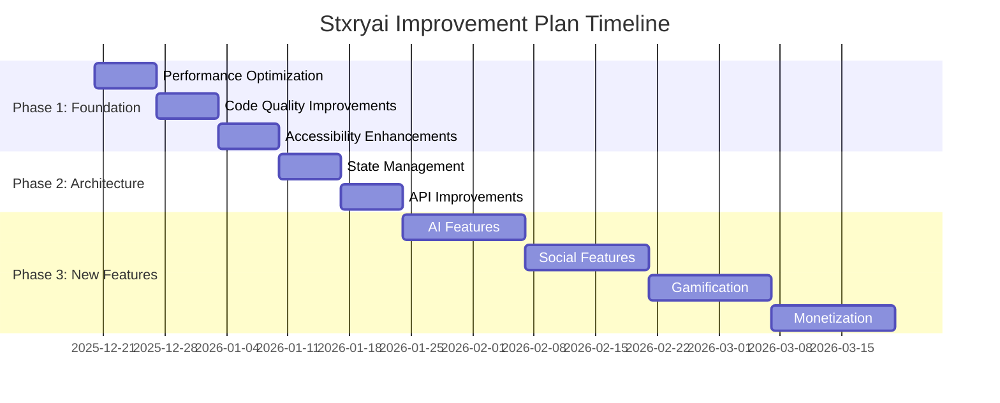

# Comprehensive Improvement Plan for Stxryai

## Executive Summary

This document outlines a comprehensive plan to improve the Stxryai interactive fiction platform. The plan focuses on performance optimization, code quality improvements, accessibility enhancements, and the addition of exciting new features to enhance user engagement and platform growth.

## Current State Analysis

### Strengths
- Modern, polished UI/UX with Framer Motion animations
- Well-organized modular architecture
- Robust authentication system with Supabase
- Comprehensive story management features
- Responsive design using Tailwind CSS

### Areas for Improvement

#### 1. Performance Optimization
- **Current Issues**: Large bundle sizes, potential rendering bottlenecks
- **Impact**: Slower load times, reduced user experience
- **Solution**: Implement lazy loading, code splitting, and query optimization

#### 2. Code Quality
- **Current Issues**: Inconsistent TypeScript typing, basic error handling
- **Impact**: Potential runtime errors, harder maintenance
- **Solution**: Comprehensive typing, improved error handling, and testing

#### 3. Accessibility
- **Current Issues**: Limited keyboard navigation, missing ARIA attributes
- **Impact**: Reduced accessibility for users with disabilities
- **Solution**: Implement full accessibility compliance

#### 4. State Management
- **Current Issues**: Basic context API usage for complex state
- **Impact**: Potential performance issues with frequent re-renders
- **Solution**: Evaluate and implement robust state management

#### 5. API Design
- **Current Issues**: Inconsistent response formats, lack of documentation
- **Impact**: Harder integration and maintenance
- **Solution**: Standardize formats and add comprehensive documentation

## Proposed Improvements

### Phase 1: Foundation Enhancements (Weeks 1-2)

#### Performance Optimization
- Implement lazy loading for all components and images
- Add code splitting for large bundles using Next.js dynamic imports
- Optimize database queries with Redis caching
- Implement server-side rendering for critical pages

#### Code Quality Improvements
- Add comprehensive TypeScript interfaces for all major components
- Implement consistent error handling patterns
- Add unit tests for all services and utility functions
- Add integration tests for critical user flows

#### Accessibility Enhancements
- Implement keyboard navigation for all interactive elements
- Add ARIA attributes to all components
- Ensure WCAG 2.1 AA color contrast compliance
- Add screen reader support

### Phase 2: Architecture Improvements (Weeks 3-4)

#### State Management
- Evaluate Zustand vs Redux for state management
- Implement chosen solution for complex state
- Add optimistic UI updates for better responsiveness
- Implement proper state persistence

#### API Improvements
- Standardize all API response formats
- Add OpenAPI/Swagger documentation
- Implement proper versioning strategy
- Add rate limiting and request validation

### Phase 3: New Feature Development (Weeks 5-8)

#### AI-Powered Features
- **AI Story Summaries**: Generate concise summaries of completed stories
- **AI Recommendations**: Personalized story recommendations based on reading history
- **AI Story Creation**: Assist users in creating new stories with AI suggestions

#### Social Features
- **Custom Story Sharing**: Share stories with customizable links and previews
- **Collaborative Writing**: Multiple users can work together on stories
- **Reading Clubs**: Create and join clubs for group reading experiences

#### Gamification
- **Achievement System**: Badges for reading milestones and accomplishments
- **Leaderboards**: Show most active readers and top contributors
- **Daily Challenges**: Encourage regular engagement with reading goals

#### Monetization
- **Premium Marketplace**: Sell and purchase premium stories
- **Subscription Tiers**: Offer exclusive content for subscribers
- **Creator Tipping**: Allow readers to tip their favorite creators

#### Content Moderation
- **Automated Filtering**: AI-powered content moderation
- **User Reporting**: Easy reporting system for inappropriate content
- **Moderation Dashboard**: Admin tools for content management

## Technical Implementation Details

### Performance Optimization

```typescript
// Example: Lazy loading component
const LazyComponent = dynamic(() => import('./HeavyComponent'), {
  loading: () => <LoadingSpinner />,
  ssr: false
});

// Example: Query caching with SWR
const { data: stories } = useSWR('/api/stories', fetcher, {
  revalidateOnFocus: false,
  refreshInterval: 300000 // 5 minutes
});
```

### State Management with Zustand

```typescript
// Example: Zustand store
interface StoryState {
  stories: Story[];
  loading: boolean;
  error: string | null;
  fetchStories: () => Promise<void>;
}

const useStoryStore = create<StoryState>((set) => ({
  stories: [],
  loading: false,
  error: null,
  fetchStories: async () => {
    set({ loading: true });
    try {
      const stories = await storyService.getFilteredStories();
      set({ stories, loading: false });
    } catch (error) {
      set({ error: error.message, loading: false });
    }
  }
}));
```

### AI Story Recommendation Algorithm

```typescript
// Example: Recommendation algorithm
async function getPersonalizedRecommendations(userId: string): Promise<Story[]> {
  // Get user's reading history
  const history = await getUserReadingHistory(userId);
  
  // Analyze preferences using AI
  const preferences = await analyzeReadingPreferences(history);
  
  // Get recommended stories
  const recommendations = await storyService.getFilteredStories({
    genres: preferences.topGenres,
    sortBy: 'relevance'
  });
  
  return recommendations;
}
```

## Success Metrics

### Performance Metrics
- **Goal**: Reduce initial load time by 40%
- **Measurement**: Lighthouse performance score
- **Target**: 90+ performance score

### User Engagement
- **Goal**: Increase average session duration by 25%
- **Measurement**: Analytics tracking
- **Target**: 15+ minutes average session

### Conversion Rates
- **Goal**: Increase premium subscription conversion by 30%
- **Measurement**: Subscription analytics
- **Target**: 5% conversion rate

### Accessibility Compliance
- **Goal**: Achieve WCAG 2.1 AA compliance
- **Measurement**: Automated and manual testing
- **Target**: 100% compliance

## Implementation Timeline



## Risk Assessment

### Technical Risks
- **Integration Complexity**: New features may require significant refactoring
- **Mitigation**: Phased implementation with thorough testing

### Performance Risks
- **Increased Load**: New features may impact performance
- **Mitigation**: Performance testing at each phase

### User Adoption Risks
- **Feature Overload**: Too many new features may confuse users
- **Mitigation**: Gradual rollout with user education

## Budget and Resources

### Development Resources
- 2 Senior Developers (Full-time, 8 weeks)
- 1 UI/UX Designer (Part-time, 4 weeks)
- 1 QA Engineer (Full-time, 8 weeks)

### Infrastructure Costs
- Additional cloud resources for AI features
- CDN for improved content delivery
- Monitoring and analytics tools

### Estimated Budget
- Development: $40,000
- Infrastructure: $10,000
- Contingency: $5,000
- **Total**: $55,000

## Conclusion

This comprehensive improvement plan addresses both technical debt and feature enhancements to position Stxryai as a leading interactive fiction platform. The phased approach ensures minimal disruption while delivering maximum value to users and stakeholders.

## Next Steps

1. Review and approve this plan
2. Prioritize Phase 1 improvements
3. Begin implementation with performance optimization
4. Schedule regular progress reviews
5. Prepare for Phase 2 architecture improvements